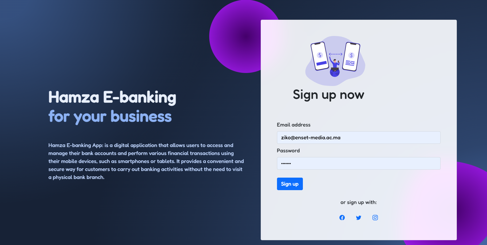
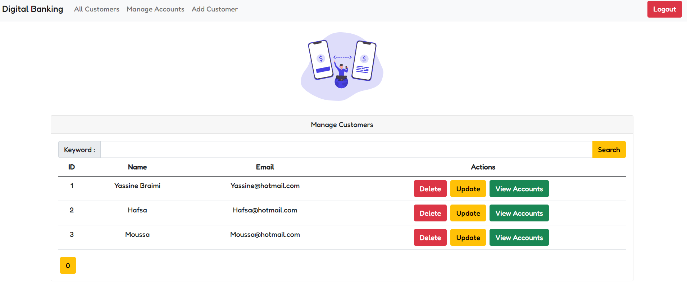

# DigitalBankingApp
Digital Banking Application (Web &amp; Mobile) Built With Spring Boot And Angular

Hamza E_BanKing est une application qui permet de gérer des comptes bancaires. chaque compte appartient à un client. un compte peut subir plusieurs opérations de type DEBIT ou CREDIT. Il existe deux types de comptes : Comptes courants et comptes épargnes.
1. Créer un projet Spring Boot
2. Créer les entités JPA : Customer, BankAccount, Saving Account, CurrentAccount, AccountOperation
3. Créer les interfaces JPA Repository basées sur Spring Data
4. Tester la couche DAO
Partie 1 : Couche services, DTO et mappers

Partie 3 : Couche Web (RestControllers) 
Partie 4 : Frontend Angular 
Partie 5 : Sécurité avec Spring Security et JWT 

<h1>Hamza Braimi</h1>